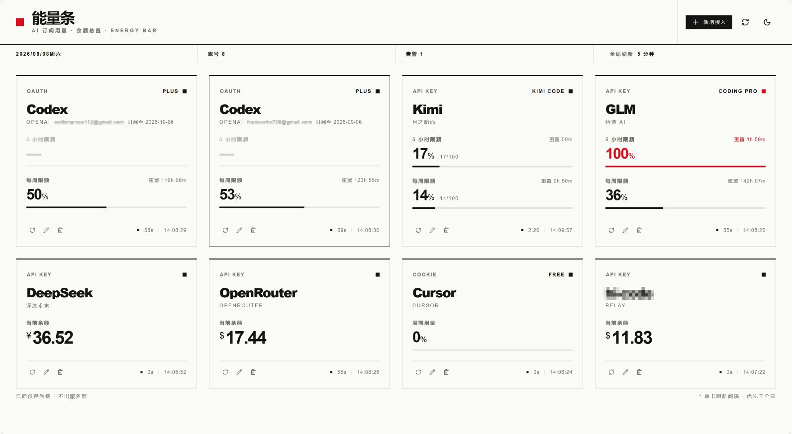

<div align="center">

# ⚡ 能量条 Energy Bar

**一块牌子上，挂满你所有 AI 订阅的"能量"——剩余用量、限额窗口、账户余额，一眼看完。**

</div>

**能量条**是一个本地优先的 AI 用量总览面板：把 Codex、Claude Code、GLM、Kimi 这类订阅制的**剩余限额**，与 DeepSeek、OpenRouter、阿里云百炼这类按量付费厂商的**账户余额**，集中展示在一张卡片面板上。支持同厂商多账号、悬浮编辑、全局/单卡两级定时刷新。

界面采用**瑞士国际主义（Swiss International Typographic Style）**设计语言：强网格对齐、Helvetica 系字体、细分割线、黑白灰 + 信号红，支持亮色/暗色双主题。

<div align="center">


</div>

---

## 📸 界面预览

<div align="center">
  
  <br />
  <sub>主面板：订阅限额、账户余额、刷新倒计时，一屏尽览</sub>
</div>

---

## ✨ 主要功能特性

- **多厂商聚合**：订阅制（限额窗口）与按量付费（余额）两类卡片统一展示，厂商目录可扩展
- **同厂商多账号**：厂商与账号分离，一个 Codex 可以挂"主账号 / 团队号"等多个实例，卡片以昵称区分
- **拖拽排序**：卡片可自由拖拽调整顺序（网格内跨行跨列），顺序持久化保存
- **卡片编辑与删除**：卡脚常驻编辑/删除按钮，删除有二次确认弹窗
- **新增接入向导**：选择供应商后按厂商动态渲染配置表单——有的要粘贴 `auth.json`，有的填 API Key，有的要 Cookie，有的还要 OrgID
- **两级定时刷新**：全局统一刷新间隔 + 单卡覆盖（单卡优先），卡片实时显示下次刷新倒计时；卡脚可单卡立即刷新
- **每接入独立代理**：每个账号可选配 HTTP / SOCKS4 / SOCKS5 代理，该接入的所有厂商请求（含 token 自动刷新）走代理
- **token 自动刷新**：Codex 等 OAuth 接入在 access_token 临近过期或 401/403 时自动用 refresh_token 刷新并回写新凭证
- **状态告警**：用量 ≥80% / 余额过低 / 拉取失败时自动标红提示
- **亮暗双主题**：跟随系统偏好，支持手动切换，本地记忆不闪烁
- **全栈后端**：厂商接口请求、卡片列表/顺序、账号配置与 API Key 全部存放在后端，单一 JSON 文件存储

> 💡 接入进度：**Codex（5 种授权）、Claude Code、GitHub Copilot（设备授权/PAT）、Gemini CLI、MiniMax（Coding Plan）、Cursor、Windsurf（Devin）、Kilo（Kilo Pass）、OpenCode、DeepSeek、SiliconFlow、Moonshot (Kimi)、OpenRouter、GLM Coding Plan、中转站（OpenAI 兼容计费）** 均已接通真实查询（服务端直连厂商 API）。其中 Moonshot / 智谱 Coding Plan 区分国内/国际站（智谱另支持国内团队版）；**中转站**支持 new-api / one-api / uni-api / sub2api 三类计费接口，自动检测或手动指定格式。项目**不含任何 mock 数据**，厂商目录只保留已接入的供应商。新增厂商：在 `src/vendors/` 新建文件（导出 `VendorDef` + `Adapter`），再到 `index.ts` 注册即可。
>
> ⚠️ 已知限制：① **智谱按量计费**账户无任何公开余额/配额 API（余额只能看控制台）；② **Codex Cookie 方式与 OAuth 设备授权**需要能直连 OpenAI 的网络（ChatGPT/Cloudflare 会拦截数据中心 IP），优先使用 auth.json / sub2api / cliproxy 三种 JSON 授权。每个接入可在配置中**指定独立 HTTP/SOCKS 代理**，规避网络拦截。

## 🧰 技术栈

| 类别 | 选型 |
| --- | --- |
| 框架 | [Next.js 14](https://nextjs.org)（App Router，前后端一体）+ React 18 + TypeScript 5.8 |
| 样式 | [Tailwind CSS 4](https://tailwindcss.com)（`@tailwindcss/postcss`） |
| 组件体系 | [shadcn/ui](https://ui.shadcn.com) 风格（Radix Slot + CVA，已配置 `components.json`，可直接 `npx shadcn add` 扩展） |
| 拖拽排序 | [@dnd-kit](https://dndkit.com)（core / sortable / utilities） |
| 图标 | [lucide-react](https://lucide.dev) |
| 数据存储 | 单一 JSON 文件 `data/store.json`（服务端读写，含密钥，已 gitignore） |
| 设计语言 | 瑞士国际主义（黑白灰 + 信号红 `#E30613`、零圆角、细线分隔、tabular-nums） |

## 🚀 安装与配置

**环境要求**：Node.js ≥ 18.17，npm ≥ 9

```bash
# 1. 安装依赖
npm install

# 2. 启动开发服务器（默认 http://127.0.0.1:5173）
npm run dev

# 3. 生产构建 & 启动
npm run build
npm run start
```

> 首次启动会自动生成数据文件 `data/store.json`（空账号列表 + 默认全局设置，**不会**提交到仓库）。所有账号配置与 API Key 都存放在该文件中。

## 📖 使用方法

1. **新增接入**：点击报头右上角「+ 新增接入」→ 在九宫格中选择供应商 → 按提示填写凭据与昵称 → 添加。
   - 例如 Codex 需要粘贴 `~/.codex/auth.json` 内容；Kimi 需要网页 Cookie；阿里云百炼需要 API Key + OrgID。
   - 凭据保存在**后端** `data/store.json`，前端只显示"已保存"占位，编辑时留空则保持不变。
2. **编辑 / 删除**：点击卡脚左侧 ✏️ / 🗑 按钮修改或删除该账号（编辑时厂商不可更换，删除需弹窗确认）。
3. **刷新**：
   - **全局刷新间隔**：元信息条右侧下拉统一设定（30 秒 ~ 1 小时，或手动）。
   - **单卡覆盖**：编辑账号时单独设定，`*` 标记且优先于全局。
   - 也可随时点击报头的刷新按钮立即刷新全部；所有厂商请求由**后端**发起。
4. **主题切换**：报头太阳/月亮按钮切换亮暗模式，偏好持久化。

## 📁 项目目录结构

```
ai-usage-board/
├── components.json          # shadcn/ui 配置（别名、样式、CSS 变量）
├── next.config.mjs          # Next.js 配置
├── postcss.config.mjs       # Tailwind v4 PostCSS 插件
├── package.json
├── tsconfig.json
├── LICENSE
├── docs/                    # 文档与界面截图
├── data/                    # 运行期生成：store.json（含密钥，已 gitignore）
└── src/
    ├── app/
    │   ├── layout.tsx       # 根布局（暗色防闪烁脚本 + 元信息）
    │   ├── page.tsx         # 首页（渲染 Dashboard）
    │   ├── globals.css      # Tailwind v4 入口 + 明暗两套设计令牌
    │   └── api/             # API 路由（全栈后端）
    │       ├── state/route.ts            # GET 全量状态（账号已脱敏 + 设置）
    │       ├── accounts/route.ts         # POST 新增账号
    │       ├── accounts/reorder/route.ts # POST 拖拽排序
    │       ├── accounts/[id]/route.ts    # PUT/DELETE 更新、删除
    │       ├── settings/route.ts         # GET/PUT 全局刷新间隔
    │       └── usage/                    # 用量刷新（服务端发起厂商请求）
    ├── components/
    │   ├── Dashboard.tsx     # 主界面：状态管理、ticker、拖拽、对话框编排
    │   ├── AccountDialog.tsx # 新增/编辑账号对话框（密钥 KEEP_SECRET 哨兵）
    │   ├── ConfirmDialog.tsx # 删除确认弹窗
    │   ├── ProviderCard.tsx  # 供应商用量卡片（限额进度条 / 余额）
    │   └── ui/               # shadcn 基础组件（button / badge）
    ├── vendors/              # 厂商目录：每家厂商一个独立文件（含接入方式 + 适配器）
    │   ├── index.ts          # 聚合 VENDORS / VENDOR_MAP / ADAPTERS
    │   ├── codex-common.ts   # Codex 共用：授权解析 + wham/usage 查询 + token 主动/被动刷新 + 账号信息（名称/订阅到期）
    │   ├── codex.ts          # Codex · 下拉选择授权方式（auth.json / Cookie / sub2api / cliproxy / OAuth）
    │   ├── deepseek.ts       # DeepSeek · 按量计费
    │   ├── siliconflow.ts    # SiliconFlow · 按量计费
    │   ├── moonshot.ts       # Moonshot (Kimi) · 按量余额 + Kimi Code 配额（国内/国际站可选）
    │   ├── openrouter.ts     # OpenRouter · 按量计费（USD）
    │   ├── relay.ts          # 中转站 · OpenAI 兼容计费（new-api/one-api/sub2api，自动检测格式）
    │   └── zhipu-coding.ts   # GLM Coding Plan · 订阅配额 5h/每周（裸 Key，个人/团队版）
    └── lib/
        ├── types.ts          # 核心类型：VendorDef / Account / KEEP_SECRET / AccountInput
        ├── store.ts          # 存储层：JSON 读写、密钥脱敏、写队列（无种子数据）
        ├── usage.ts          # 用量刷新服务（并发去重、失败兜底）
        ├── adapters.ts       # 适配器注册与调用（实现按厂商拆分在 vendors/）
        ├── http.ts           # 服务端带鉴权/超时的 HTTP 工具
        ├── client-api.ts     # 前端 API 客户端
        └── utils.ts          # cn() 工具函数
```

> **新增厂商三步走**：① 在 `src/vendors/` 新建 `<vendor>.ts`（导出 `VendorDef` + `Adapter`）；② 在 `src/vendors/index.ts` 注册；③ 完成。同一供应商的多种接入方式（如订阅 Plan、按量计费）各自独立成一个文件，视为不同的"厂商"。

## 🔌 后端 API 一览

| 方法 | 路径 | 说明 |
| --- | --- | --- |
| GET | `/api/state` | 全量状态：账号列表（密钥已脱敏）+ 全局设置 |
| POST | `/api/accounts` | 新增账号（服务端生成 id 与初始用量） |
| PUT / DELETE | `/api/accounts/:id` | 更新（密钥留空保持）/ 删除账号 |
| POST | `/api/accounts/reorder` | 按 ids 重排卡片顺序 |
| GET / PUT | `/api/settings` | 读取 / 更新全局刷新间隔 |
| GET | `/api/usage/:id?refresh=1` | 刷新单个账号用量 |
| POST | `/api/usage/refresh-all` | 刷新全部账号 |

## 🤝 贡献指南

欢迎任何形式的贡献！提交前请遵循：

1. 先开 **Issue** 讨论新功能或重大改动，避免返工。
2. Fork 本仓库，在独立分支上开发，分支名建议 `feat/xxx` 或 `fix/xxx`。
3. 提交信息遵循 [Conventional Commits](https://www.conventionalcommits.org/zh-hans/) 规范，如 `feat: add deepseek adapter`、`fix: countdown drift`。
4. 改动前先跑 `npm run dev` 自测，确保 `tsc --noEmit` 无类型错误。
5. 提交 Pull Request，描述改动动机与影响范围。

## 📄 许可证

本项目基于 [MIT License](./LICENSE) 开源，Copyright © 2026 刘白菜。

---

<div align="center">

*凭据仅存后端 · 用量一目了然* ⚡

</div>
