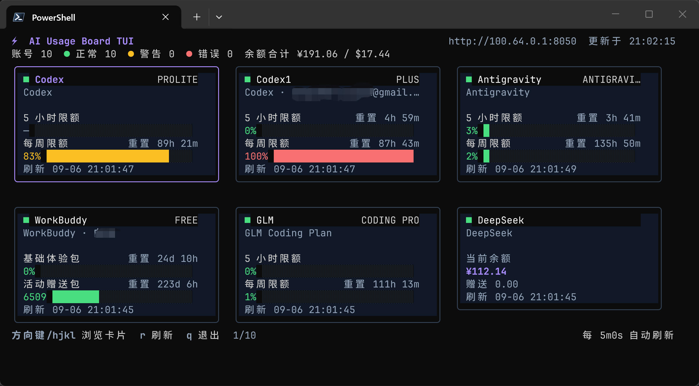

# AI Usage Board TUI

用于在 Windows、Linux 和 macOS 终端中查看 AI Usage Board 的账号余额、订阅配额与异常状态。



上图展示了 TUI 的实际卡片网格：每个账号对应一个方块，余额卡片和配额卡片按内容自适应高度，终端变窄时自动减少列数。

## 运行

先启动仓库根目录的 Web 服务，再执行：

```bash
go run ./cmd/ai-usage-tui
```

默认连接 `http://localhost:5173`。常用参数：

```text
--server URL       服务地址
--token TOKEN      公共 API Token（推荐使用环境变量）
--interval 5m      自动刷新间隔，0 表示关闭
--timeout 30s      HTTP 请求超时
--version          显示版本
```

推荐通过环境变量配置，以免 Token 出现在进程参数中：

```bash
export AI_USAGE_BOARD_URL=https://usage.example.com
export AI_USAGE_BOARD_TOKEN=your-secret-token
export AI_USAGE_BOARD_INTERVAL=5m
./ai-usage-tui
```

PowerShell：

```powershell
$env:AI_USAGE_BOARD_URL = "http://localhost:5173"
$env:AI_USAGE_BOARD_TOKEN = "your-secret-token"
.\ai-usage-tui.exe
```

## 界面与操作

TUI 使用与 Web 面板一致的卡片式信息结构：

- 每个账号是一张独立卡片，直接显示厂商、套餐、账号名称、余额或配额窗口、状态和刷新时间
- 终端宽度变化时，卡片网格自动在一至四列之间调整
- 卡片高度随余额、配额窗口等实际内容自动调整，不再保留多余空白
- 厂商定义但账号未返回的配额窗口会显示为空进度条占位
- 正常状态下隐藏厂商的说明性备注，仅在警告或错误时显示原因
- 卡片超出当前屏幕时，选中项会随键盘操作自动滚动到可视区域

| 按键 | 操作 |
| --- | --- |
| 方向键 / `h j k l` | 按网格浏览卡片 |
| `g` / `Home` | 跳到第一张卡片 |
| `G` / `End` | 跳到最后一张卡片 |
| `r` | 立即刷新全部厂商 |
| `q` / `Ctrl+C` | 退出 |

## 构建单文件

Go 构建结果不依赖额外运行时或动态资源：

```bash
go build -trimpath -ldflags="-s -w" -o ai-usage-tui ./cmd/ai-usage-tui
```

Windows 输出文件名可改为 `ai-usage-tui.exe`。发布全部目标平台时安装 GoReleaser 后运行：

```bash
goreleaser release --snapshot --clean
```

生成目标包括 Windows、Linux、macOS 的 AMD64/ARM64。仓库推送 `v*` 版本标签时，GitHub Actions 也会自动测试并创建带这些单文件程序的 Release。

## 目录结构

```text
tui/
├── cmd/ai-usage-tui/       # 程序入口
├── internal/api/           # v1 API 客户端与传输类型
├── internal/config/        # 参数和环境变量
├── internal/ui/            # Bubble Tea 状态、布局与样式
├── .goreleaser.yaml        # 多平台单文件发布
├── go.mod
└── go.sum
```
